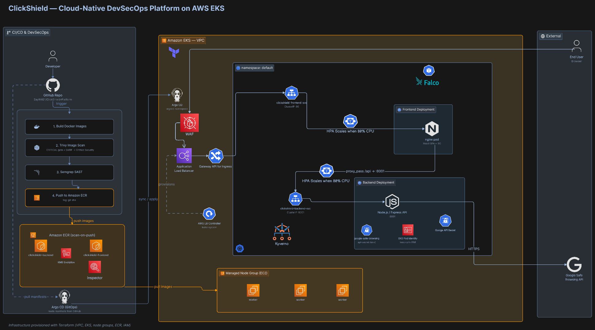

# ClickShield Platform

A DevSecOps deployment platform that containerizes the [ClickShield](https://github.com/tbhvishal/ClickShield)
phishing-detection app, scans it for vulnerabilities, and continuously deploys it to
Amazon EKS using GitOps (Argo CD).

ClickShield is a full-stack URL safety scanner (React + Vite frontend, Express API backend)
that checks URLs against Google Safe Browsing. This repo owns the **build, security, and
deployment** pipeline around it.

Please view the Wiki tab for more details on the technical process of implimenting this project. 



---

## Architecture
- **Frontend** (nginx) serves the built SPA and reverse-proxies `/api` to the backend
  (the app uses relative `/api` URLs in production, so both share one origin).
- **Backend** (Express 5) exposes `POST /api/check-url` on port `8001`.
- **Argo CD** syncs the manifests in this repo to the cluster automatically.

---

## Tech Stack

| Layer        | Tooling                                              |
|--------------|------------------------------------------------------|
| App          | React 18 + Vite (frontend), Node 20 + Express 5 (backend) |
| Containers   | Docker (multi-stage), nginx, distroless/alpine bases |
| Registry     | Amazon ECR                                           |
| CI           | GitHub Actions                                       |
| Security     | Trivy (image scanning, SARIF), SonarQube (SAST)      |
| Orchestration| Amazon EKS (Kubernetes)                              |
| GitOps / CD  | Argo CD                                              |

---

## Repository Layout

---

## CI/CD Pipeline

The GitHub Actions workflow runs on every push to `main`:

1. **Build** both images locally (`docker build`, not pushed yet).
2. **Scan** each image with Trivy → emit SARIF → upload to the **GitHub Security tab**
   (distinct `category: backend` / `category: frontend`).
3. **Gate** with a second Trivy run (`exit-code: 1`, `severity: CRITICAL`,
   `ignore-unfixed: true`) — a vulnerable image never reaches ECR.
4. **Push** to Amazon ECR, tagged with the commit SHA (`${{ github.sha }}`).
5. Argo CD detects the new manifest revision and **syncs** to EKS.

> Order matters: **build → scan(report) → upload SARIF → gate → push.**
> The SARIF upload runs with `if: always()` so findings reach the Security tab even
> when the gate fails.

---

## Prerequisites

- AWS account with an EKS cluster and ECR repositories
- `kubectl`, `aws` CLI, and access to the cluster API
- Argo CD installed in the cluster (namespace `argocd`)
- A **Google Safe Browsing API key**

---

## Configuration

The backend requires the Safe Browsing key at runtime. Store it as a Kubernetes Secret —
**never bake it into the image**:

```bash
kubectl create namespace clickshield
kubectl -n clickshield create secret generic clickshield-secrets \
  --from-literal=GOOGLE_SAFE_BROWSING_API_KEY=your_api_key_here
